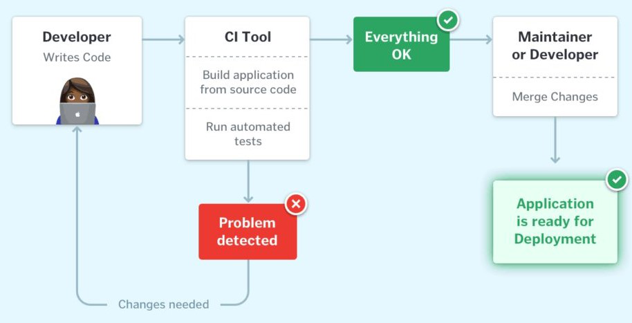

### What do you know about viasat?

Viasat is mainly known for satellite internet, and provides airplanes with wifi. For this role the advertising team will be working on adverts on planes where someone could watch ads for wifi instead of paying.

### RESTful API

An api that allows communication over the internet using HTTP (Hyper Text Transfer Protocol) methods such as GET, POST, PUT, DELETE.

### HTTPS

Extension of HTTP that uses encrytion with TLS for secure communication.

### DNS - Domain Name System

### APIs

- **REST API**:
    - Allows stateless communication and resource manipulation using standard HTTP methods (GET, POST, PUT, DELETE).
- **RPC (Remote Procedure Call)**:
    - Streamlines back-end data exchanges using binary data for lightweight communication.
- **SOAP (Simple Object Access Protocol)**: 
    - Uses xml format to ensure high security, suitable for transactions requiring strict compliance.
- **GraphQL**:
    - Allows clients to define precisely what data they need, optimizing flexibility and reducing data transfer.

### CI Workflow

### What was your day like in your internship

Basically we would have meetings which were mostly weekly, that were for ongoing features.
I would do the tasks assigned by my mentor, such as a bug fix or a feature I was working on.

One thing I worked on was a connectivity monitor action script, which aimed to monitor connectivity stats of devices and roll back any config changes that were made to the device that affected the connectivity between the device and a host.

### *Smart Window Notification System*
    - I was researching the question: How effective is the use of a notification system based on environmental data from sensors at influencing environmental factors such as air quality in an enclosed environment?
    - The motivation was that IEQ has been increasingly important as people spend 87% of their time indoors and another 6% in their vehicles.