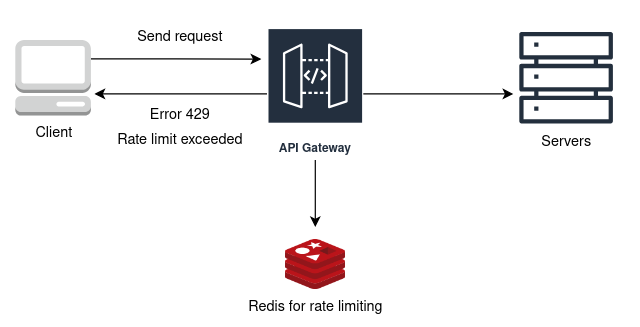

## Rate Limiter Interview Question

### Use Cases

- Prevent overload
- Protect against DDoS attacks
- Fair usage
- Cost management

### Where to implement

- *Client side*:
    - Pros: Immediate feedback, reduced server load
    - Cons: Easily bypassed, inconsistent enforcement

- *Server side*:
    - Pros: Centralised control, enhanced security
    - Cons: Increased server load, scalability challenges

- *Middleware*:
    - Pros: Scalable management, flexible policies
    - Cons: Additional complexity, potential bottlenecks

### Requirements:

- *Specify rate limits*:
    - Establish clear boundaries to ensure fair usage, prevents abuse, and protect system resources from being overwhelmed.
- *Configurability and Flexibility*:
    - Flexibility enables the system to adapt to changing requirements and handle diverse traffic patterns effectively.
- *Low latency & High performance*:
    - High-performance rate limiting ensures that legitimate requests are processed quickly, maintaining a smooth user experience.

### Algorithms

- Token bucket
- Leaky bucket
- Fixed window
- Sliding window

