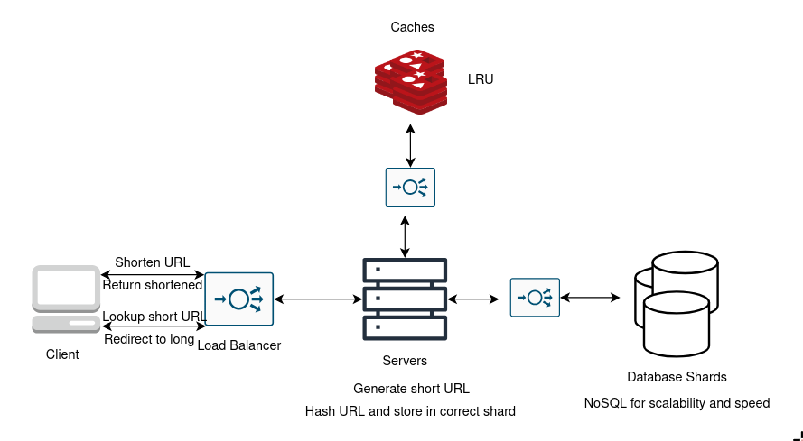

## URL Shortener

### Questions to ask

- Will the short URL expire?
    - Let's say it lasts 100 years.
- Allow custom URLs?
    - Yes, up to 16 chars
- How many shortens/month?
    - 100 million/month

### Functional Requirements

- Shorten a URL
- Short URL should redirect to long URL
- Short URL should be small as possible - 7 chars
- Can create custom short URL - max length 16 chars
- Short URL should stay in system for 100 years.

### Non-functional Requirements

- No downtime i.e. always available
- URL redirect is fast
- Service exposes REST API for devs (optional)

#### Figures

- 200:1 Read-Write Ratio (1 short URL created -> 200 short URLs clicked)
- 100 mil short URLs created/mo.
- 40 short URLs created/sec.
- 8000 short URLs clicked/sec.
- short URLs stored 100yrs, so 120 billion objects
- Object = ~500 bytes -> 60TB storage
- 700 mil reads/day, cache 20% of requests -> 70GB cache memory

### Schemas

- **User**:
    - user_id
    - name
    - email
    - date_created

- **Link**:
    - short_url (7 chars)
    - long_url
    - user_id
    - date_created

### Server Requirements

- Generate short URL:
    - base62 encode
    - key generation service (will need a separate database with all possible keys)

### Database

- Choose NoSQL, as we are dealing with massive storage and high reads/writes.
- Can scale horizontally i.e. database sharding, we can do this by hashing the URL and using it as a key which determines which shard to store it in.

### Caching

- Store 20% of traffic
- Can use LRU
- Have cache replicas

### Load Balancer

- Can be placed between:
    - client and application server
    - app servers and databases
    - app servers and caches
- Can use algorithm like round-robin, and if one of the servers are down we can do a health check and adjust based on that.
- Consider all the popular links ending up on the same cache server.

### Diagram

