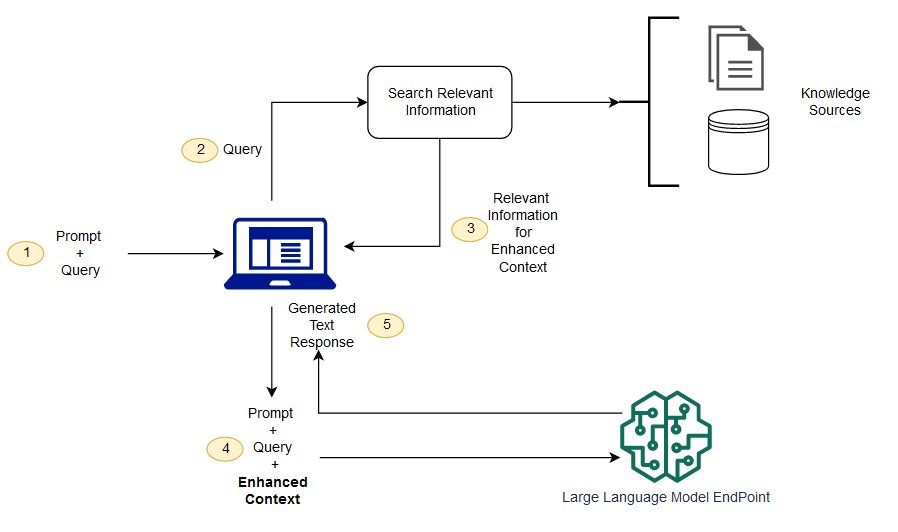

### Retrieval Augmented Generation (RAG)

- Solves the problem of LLMs having limited or outdated knowledge
- Attaches an info retrieval component, uses user input to retrieve info from new data source
and both user input and relevant information are given to the LLM
- How it works:
    - Convert external data into embeddings and store them into a vector database
    - Convert the user query into an embedding (vector representation) and matched with vector database
    - RAG model augments the user input by adding relevant data in context
- Examples of vector databases: Pinecone, Weaviate

 
[source](https://aws.amazon.com/what-is/retrieval-augmented-generation/)

### What are Transformers?

- A neural network architecture designed to process sequential data using a mechanism called attention.
- It consists of an encoder, which takes in the input sequence, and a decoder, which takes all the encodings and
generates the output sequence.
- Each part contains its own self-attention mechanism and feedforward network.
- They can process multiple sequences in parallel.
- Semi-supervised learning.