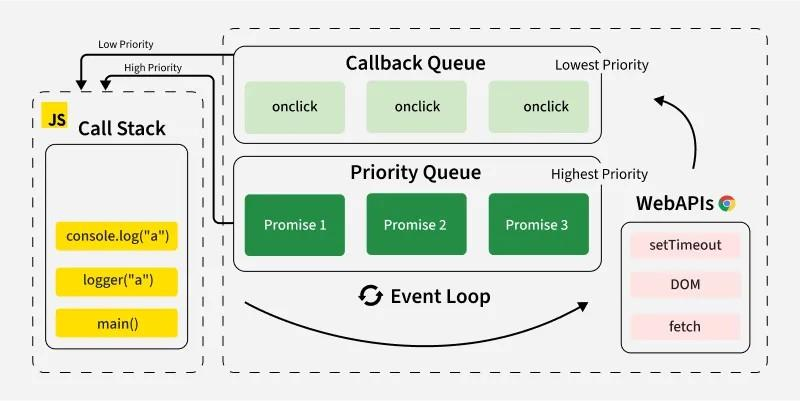
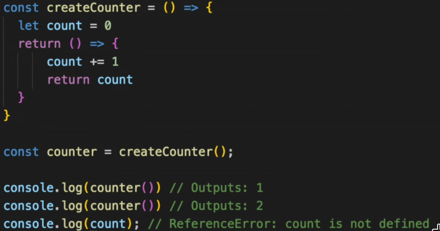

### Asynchronous Programming
- Asynchronous programming is a technique that allows a program to start a 
long-running task and continue executing other tasks without waiting for the first one to finish.

### Promise
- represents the future result of an asynchronous operation.
- either pending, fulfilled, or rejected.

### Callback function
- A callback function is a function that is passed as an argument to another function 
and is executed at a later time, often in response to an event or after an asynchronous operation completes.

### Event loop — call stack, microtask queue, macrotask queue
- JS is single-threaded, so it has one call stack that executes code line by line.
When you hit something async (like setTimeout or a fetch), it gets handed off to the browser, and when it's done,
its callback goes into a queue rather than running immediately.
- There are two queues: the microtask queue (promises, queueMicrotask)
and the macrotask queue (setTimeout, setInterval, UI events).
- After each task on the call stack finishes,
the event loop drains the entire microtask queue before picking the next macrotask.
That's why a Promise.then() always runs before a setTimeout(fn, 0), even though both are "async."


<br>
[source: GeeksForGeeks](https://www.geeksforgeeks.org/javascript/what-is-an-event-loop-in-javascript/)

### Explain closures and give a real example of where you'd use one
A closure is when a function "remembers" the variables from its outer scope even
after that outer function has finished running. This happens because JS functions keep a reference
to the scope they were created in, not just where they're called from.
Let's you create private variables.

<br>
Real use cases:
- private state (like the counter above)
- memoization
- things like debounce/throttle implementations where you need to track state between calls.

### Hoisting
- Moves var declarations to the top of the scope, so you can use them before they are declared.
- let/const variables get a ReferenceError when used before declared.
- function declarations are usable before declaration, function expressions are not (const hello = function...)

### Difference between let, const, and var, and why avoid var?
- var is function-scoped and gets hoisted with a default value of undefined, which can cause confusing bugs
(using a variable before it's "declared" just gives undefined instead of an error).
- let and const are block-scoped and live in the "temporal dead zone" until their line executes,
so accessing them early throws an error instead of silently giving you undefined.
- const additionally prevents reassignment (not full immutability, you can still mutate an object
or array declared with const).
- Modern code avoids var because block scoping is more predictable and catches bugs earlier.

### == vs ===
=== checks both type and value. == coerces both sides to the same type.

### Event delegation
Instead of attaching an event listener to every individual child element,
you attach one listener to a shared parent and use the event.target (or closest())
to figure out which child was actually interacted with.
It works because of event bubbling, the event fires on the child first, then bubbles up through its ancestors.
Pros: fewer listeners (better memory/performance), and it automatically works for elements added to the DOM later,
since you're not binding to the child directly.
- stopPropagation stops bubbling

```js
const customUI = document.createElement('ul');

// moved function outside to prevent function duplication
function responding(evt) {
    if (evt.target.nodeName === 'li')
        console.log('Responding')
}

for (var i = 1; i <= 10; i++) {
    const newElement = document.createElement('li');
    newElement.textContent = "This is line " + i;
    customUI.appendChild(newElement);
}

// add event listener to parent
customUI.addEventListener('click', responding);
```

### Synchronous vs asynchronous
- Synchronous code runs top to bottom, blocking until each line finishes.
- Asynchronous code lets long-running operations (network requests, timers, file I/O)
happen in the background without freezing the rest of the program.

### How would you optimize a slow-loading web page?
minimize and compress assets (JS/CSS/images), lazy-load images and non-critical resources,
reduce the number of network requests (bundling, caching), use a CDN

### Debouncing vs throttling
- Debounce waits until the events stop for a set period before running the function once.
- Throttle runs the function at most once every fixed interval regardless of how often the event fires.

### Semantic HTML
Using elements that describe their meaning (nav, button, article, header) instead of generic divs for everything. It matters for accessibility and SEO

### this
- refer to object that's currently executing the function
- value is dynamic, determined how the function is called
- if it's used in a method as a callback, it loses its context and defaults to global window
- that's why we use arrow functions, so it doesn't lose its context

### Race condition where async requests resolve out of order
- a search box firing a request per keystroke, where an older request resolves after a newer one and
overwrites the newer results.
- Use AbortController which aborts the previous request

### Prototypal inheritance
- JS objects have an internal link to another object, called their prototype.
- When accessing a property or method on an object that's not found on it, it
walks up the prototype chain, until it finds property or null.

```js
const animal = {
  eat() {
    console.log("eating");
  }
};

const dog = Object.create(animal);
dog.bark = function() {
  console.log("barking");
};

dog.bark(); // "barking" — found directly on dog
dog.eat();  // "eating" — not found on dog, so JS looks up the chain to animal
```

#### Class
```js
class Animal {
  constructor(name) {
    this.name = name;
  }
  eat() {
    console.log(this.name + " is eating");
  }
}
```